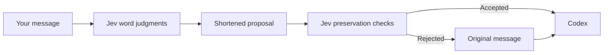

# Codex–Jev

Use the official Codex desktop app with Jev checking and shortening eligible messages before they reach the Codex model. A macOS menu bar app provides the toggle, API-key settings, compression modes, and token counters; a pink Dock shortcut opens the Jev-enabled app.

Outgoing compression uses Jev to decide which words are needed and which material must stay verbatim. A custom Codex engine separately handles eligible tool output and older tool exchanges. Compression is optional, and rejected proposals keep the original content.

This is an independent project, not an official OpenAI or TypeSafe release. The desktop integration uses undocumented launch hooks that may change with app updates. It does not modify the installed official app bundle.

## Components

| Component | Purpose |
| --- | --- |
| Menu bar launcher | Toggle the Jev trial instance on/off, open Codex, and find settings and logs. |
| [Desktop bridge](macos-app/bridge/README.md) | Check eligible outgoing messages with Jev before forwarding them to the custom engine. |
| [Custom engine](JEV.md) | Reduce eligible tool output and older tool exchanges using bounded, extractive compression. |
| Dock wrapper | Pink Codex Jev.app shortcut that opens the official app with Jev enabled. |

## Build on macOS

Requires macOS 14+, Xcode Command Line Tools with Swift 6, Rust 1.95.0 via rustup, and Python 3.11+. Tested on Apple Silicon; Intel builds are unverified. Live use requires a Codex login and a TypeSafe API key. This is a source release with local ad-hoc signing, not a notarized installer.

```sh
git clone https://github.com/yannip1234/codex-jev.git
cd codex-jev
python3 macos-app/build-backend.py
mkdir -p dist
macos-app/launcher/build-launcher.sh "$PWD/dist"
macos-app/launcher/build-dock-app.sh "$PWD/dist"
open "dist/Codex Jev Launcher.app"
```

The backend build downloads and verifies pinned upstream V8 artifacts. It can take substantial time and disk space. The menu bar app bundles its engine, bridge, and message helper; the old JevCodex chat app is no longer required. Keep `Codex Jev.app` beside `Codex Jev Launcher.app` if using the Dock shortcut. Drag the pink `Codex Jev.app` into the Dock to keep it there. Clicking it opens or activates the official Codex app with Jev enabled. Quitting the Dock wrapper does not quit Codex.

## Get started

After building the apps:

1. Open **Codex Jev Launcher.app**, then **Jev → Settings…** in the menu bar.
2. Paste your TypeSafe API key and click **Save Key**. The saved key takes priority over `TYPESAFE_API_KEY`.
3. Enable **Compact outgoing messages** and choose **Balanced** or **Strict (caveman)**.
4. Turn on **Jev → Use Codex–Jev** and send a message in the trial Codex window.
5. Check the token counters or [activity logs](#check-whether-jev-is-working) to see whether Jev checked and shortened it.

Your Codex login remains separate from the Jev key. The Jev controls live in the menu bar app, not the official app's Settings.

## Launcher and Settings

Click **Jev** in the macOS menu bar, then **Use Codex–Jev**. On starts a separate official-app profile using the Jev bridge. Off asks before closing that trial instance, then opens standard Codex. It never force-quits the trial or closes regular Codex instances. Switching cannot hot-swap the engine inside an active turn; finish work before switching off.

The indicator reflects whether the Jev trial application is running, not API health or guaranteed compression. Quitting the launcher leaves Codex running. Use **Choose Codex App…** if your installation is not at the detected `/Applications/ChatGPT.app` or `/Applications/Codex.app` path. Choose an app while the toggle is off.

**Jev → Settings…** opens Settings directly in the menu bar app. Paste your TypeSafe key into the secure field and click **Save Key**. The existing saved key is never displayed. You can replace or remove it and change compression options here; changes apply to the next request without restarting Codex. A valid saved key takes priority over `TYPESAFE_API_KEY`. Standard Edit shortcuts (including ⌘V to paste and ⌘A to select all) work in the Settings field. Outgoing-message compression has a separate toggle; tool-output compression and history compaction are configured independently. The official app itself does not gain Jev Settings controls.

## How outgoing compaction works



1. The helper numbers every whitespace-delimited word occurrence and sends the entire eligible message to Jev.
2. Jev judges whether each occurrence carries needed task information and whether it belongs to code, quotations, identifiers, literal values, or other material that must stay verbatim.
3. Code applies those judgments by deleting source spans. There are no filler dictionaries, syntax detectors, or preselected word candidates in this outgoing pass; word indexing and applying score cutoffs are mechanical.
4. Jev checks the combined proposal for task meaning, lost constraints, and changes to verbatim material. An accepted proposal is archived alongside its original and forwarded to Codex. Failed or incomplete reviews keep the original.

| Outgoing mode | Behavior |
| --- | --- |
| **Balanced** (default) | Favors readable prose, uses stricter preservation cutoffs, and requires at least 16 estimated tokens and 10% savings. |
| **Strict (caveman)** | Allows telegraphic fragments and smaller savings. If the aggressive proposal fails, tries a more conservative cutoff using the same word judgments. |

Changing modes applies to the next message. Neither mode guarantees lossless meaning or the shortest possible prompt. The official app may display the shortened message when it receives the engine's turn data.

Jev returns typed judgments; it does not generate a rewritten message. Every retained word comes from the source. Words are judged in batches of up to 96, each with the full original text. Word boundaries are whitespace, so languages without spaces receive coarser decisions. Each API request has a 15-second limit; selection stops starting new batches after 30 seconds, with up to two verification requests afterward. The bridge has an 85-second outer timeout. Large or slow reviews may therefore send the original rather than partially reviewed text.

## Tool output and automatic history compaction

| Path | What can change |
| --- | --- |
| Outgoing messages | One eligible plain-text item before it reaches the custom engine. |
| Tool output | Eligible text results at the engine's history-recording boundary, including file contents returned by tools. Files on disk are not rewritten. |
| History compaction | Complete older tool call/result groups. Conversation text and recent context stay; native Codex compaction is the fallback. |

The three settings are independent. Strict outgoing mode does not change automatic history compaction. Context-limit compaction tries Jev's older-tool-exchange removal first, then falls back to normal Codex compaction if it cannot safely save enough. History selection keeps images and encrypted checkpoints unchanged in Codex history and sends Jev explicit placeholders for those opaque fields. Unknown content cannot establish redundancy. Text judgment payloads remain bounded at 90 KB, and an accepted history reduction must save at least 25% of estimated tokens. Token-budget compaction and model downshifts bypass that Jev path. The official “Context automatically compacting” indicator does not identify which compactor ran.

## Token counters

The menu shows aggregate **Original → After → Saved** token estimates; Settings also breaks them down into outgoing messages, tool output, and history. They survive app restarts by reading local metadata logs. Tracking starts with records produced by this version; earlier records without before/after counts are excluded. These are cumulative processing estimates, not billing totals: history passes may count retained text again. Native engine counts require relaunching the Jev trial after an engine update.

## Authentication and updates

OpenAI authentication remains separate and uses your existing Codex home. If needed:

```sh
"./dist/Codex Jev Launcher.app/Contents/Resources/codex-jev" login
```

You can also use `"./dist/Codex Jev Launcher.app/Contents/Resources/Try-Official-Codex-with-Jev.command"`. Set `JEV_OFFICIAL_APP` for a non-default app path with that script. The isolated desktop profile shares your existing Codex authentication, task storage, and settings. Remote control is disabled for the trial process to avoid competing with the regular app's enrolled server.

After rebuilding or replacing the engine or bridge, finish active work and relaunch the Jev trial to load the update. Changing the saved API key or compression preferences takes effect on the next request without restarting. An already-running engine cannot be hot-swapped.

## Check whether Jev is working

For outgoing messages:

```sh
tail -f "${CODEX_HOME:-$HOME/.codex}/jev-bridge/activity.jsonl"
```

For tool output and history compaction:

```sh
tail -f "${CODEX_HOME:-$HOME/.codex}/jev-bridge/engine-activity.jsonl"
```

The engine log is created when the updated engine records activity. Both logs contain metadata, not message bodies or API keys.

| Log signal | Meaning |
| --- | --- |
| Outgoing `apiCalls > 0` | The helper attempted Jev requests. Check `status` for the outcome. |
| `Jev checked · unchanged (no useful reduction).` | Jev checked the message, but no useful shortening was selected. |
| `preservation check failed` | Jev rejected the proposal; the original was sent. |
| `Structured input kept unchanged.` | The outgoing input was ineligible; no Jev request was needed. |
| Engine `api_completed` with `valid_response` | A native tool/history Jev request returned a valid result. |
| Engine `event: compacted` | A reduction was accepted; compare `originalTokens` and `compactedTokens`. |
| Engine `event: fallback` | Jev history compaction was not accepted; native Codex compaction can take over. |

A short chat message was verified with one Jev call and approximately **6 → 6 tokens**: unchanged text can still mean the integration is working. Neither the menu's On indicator nor the official app's compaction spinner proves an accepted reduction. These logs describe preprocessing, not provider billing or successful completion of the Codex turn.

## Data and limits

Eligible messages are sent to the TypeSafe API. Enabled tool/history compression can send eligible tool contents and relevant context there too. Jev incurs separate usage. Message compression accepts one plain text item, up to 40 KB, with no text-element offsets. Multiple text items and text with embedded text-element offsets bypass that pass. Attachments themselves pass through unchanged; one eligible text item can still be processed alongside an attachment. A file read can qualify separately as tool output. Compression does not rewrite files on disk.

Retained text is copied from the source. Tool output can represent exact repeated blocks with source-line references while retaining every distinct block verbatim; Jev checks the complete proposal. Semantic deletion requires a combined preservation check. API failures, timeouts, uncertainty, and insufficient savings preserve the original. Older tool exchanges can be removed during Jev history compaction; standard Codex compaction remains the fallback. The visible chat transcript is not cleared.

Private local original/prepared message archives are stored in `$CODEX_HOME/jev-message-originals`; tool/history originals are in `jev-originals` (default Codex home: `~/.codex`). These archives can contain sensitive content and must not be committed. Compression adds latency and can change meaning despite checks. Savings are estimated, not tokenizer-exact billing. Equal task accuracy and lower total cost have not been established by a benchmark.

## Verification

```sh
# Bridge protocol checks; no API requests.
python3 -m unittest discover -s macos-app/bridge -p 'test_*.py' -v
# Launcher instance selection and environment isolation checks.
swiftc -parse-as-library macos-app/launcher/LauncherConfiguration.swift \
  macos-app/launcher/LauncherTests.swift -o /tmp/jev-launcher-tests
/tmp/jev-launcher-tests
# Optional live helper test; uses the saved key and makes Jev API requests.
JEV_TEST_FILTER="$PWD/dist/Codex Jev Launcher.app/Contents/Resources/jev-message-filter" \
  python3 -m unittest discover -s macos-app/bridge -p 'test_*.py' -v
```

Shared settings/compressor regression tests (in the retained legacy source package): `swift test --package-path macos-app`; see the [native README](macos-app/README.md) for the standalone toolchain workaround. Engine test instructions are in [JEV.md](JEV.md).

Local checks include 38 Swift tests (including clipboard shortcuts, word coverage, literal preservation, rejection of meaning loss, and usage totals), five bridge protocol tests, a live helper/key-priority check, and 104 scoped Rust compaction regressions. Four live Strict message examples produced reductions; one went from approximately 24 to 8 tokens and a code-containing example from 31 to 15 with its code unchanged. A separate live native tool-compressor test accepted a repetitive-log reduction. A full app-server exercise confirmed actual Jev tool/history API requests, but both proposals were rejected and native history fallback preserved the next response. Those full-engine checks do not establish accepted history savings. A long outgoing courtesy fixture also retained its original after a failed preservation check. These are examples, not an accuracy or cost benchmark.

The menu launcher builds, its instance-selection/environment checks pass, and the Settings layout and counters were checked visually. The toggle's full interactive flow is still not exhaustively tested. This demonstrates the integration, not complete desktop compatibility. Upstream GitHub Actions are disabled pending a project-specific CI setup.

## Upstream and license

Based on [OpenAI Codex](https://github.com/openai/codex), source commit `7498521d288b9b3b96ffba4eedf089d8d6e06a84`. Imported source and local changes remain in Git history. See [LICENSE](LICENSE), [NOTICE](NOTICE), and the preserved [upstream README](README.upstream.md).

## Acknowledgments

Inspired by [tamaratran/fast-jev-compaction](https://github.com/tamaratran/fast-jev-compaction), which uses Jev to decide which older tool calls and results to retain for Claude Code. That project motivated exploring a similar approach for the Codex engine and desktop workflow.

Strict outgoing mode also draws inspiration from [Caveman](https://github.com/JuliusBrussee/caveman): omit expendable prose while retaining exact technical details. The implementation here uses Jev judgments and source-span deletion, not the Caveman CLI.
